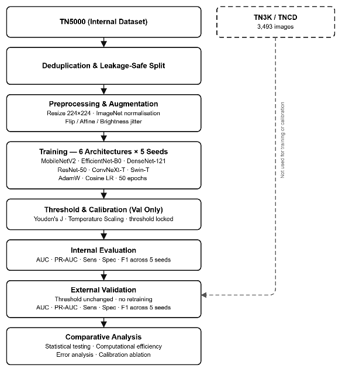
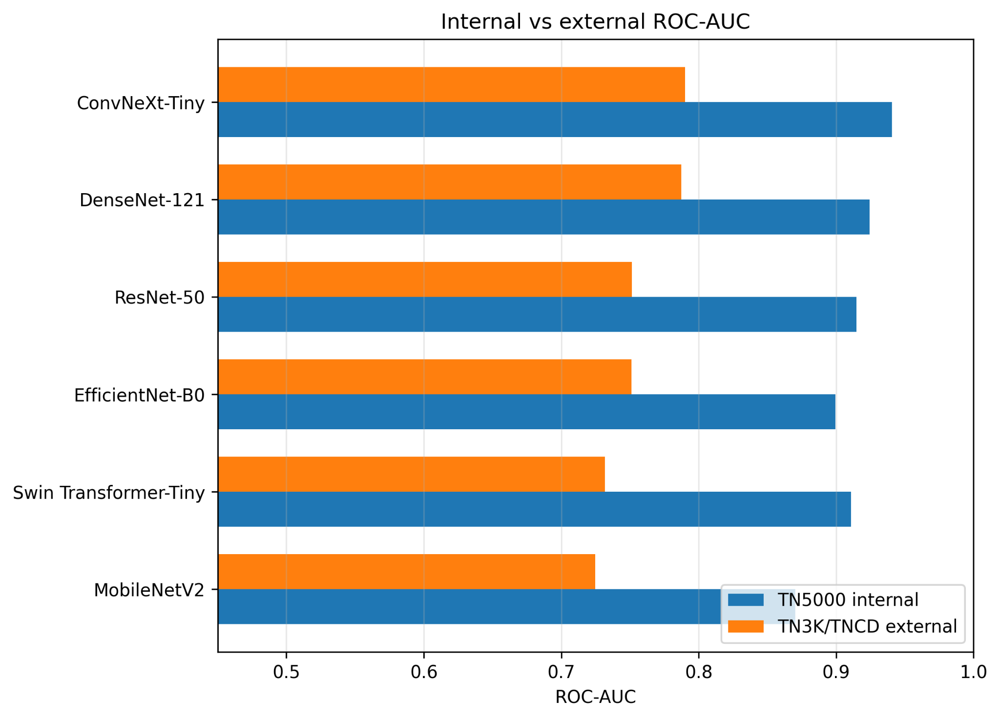
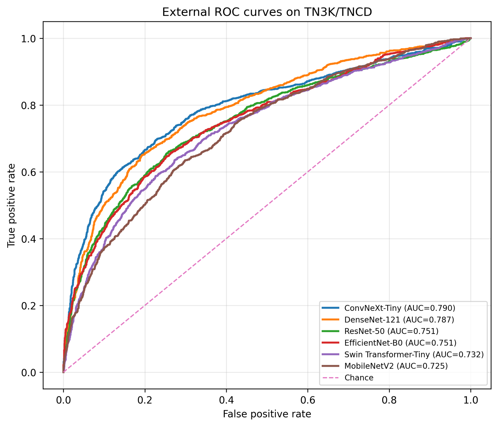
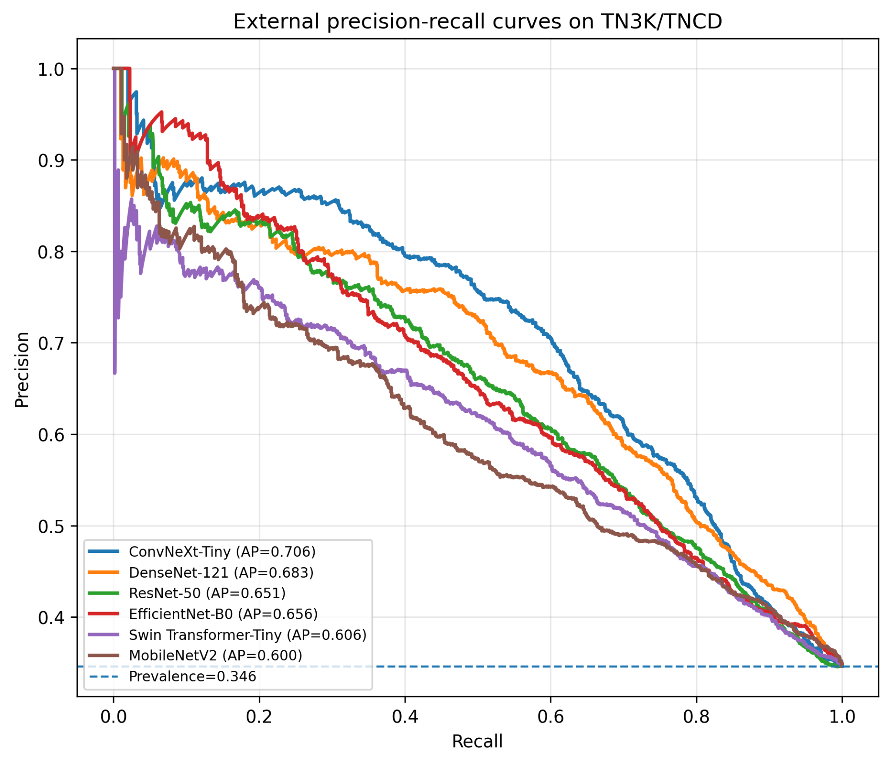
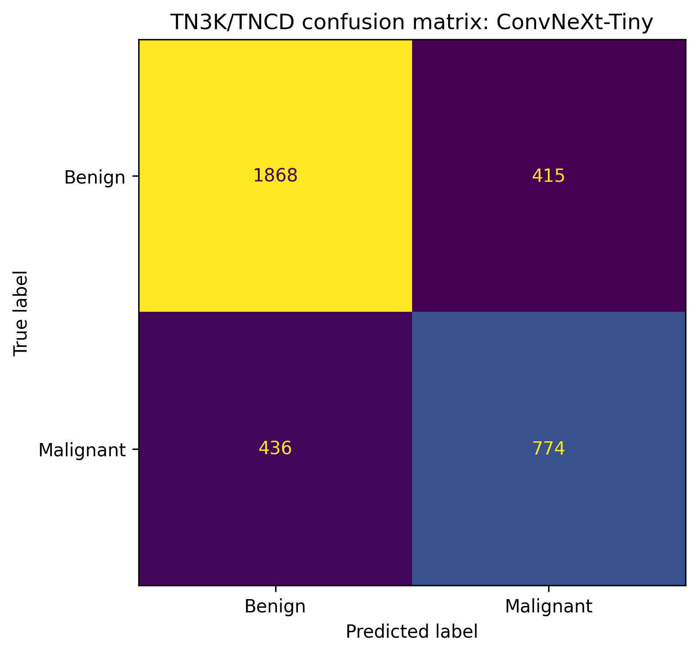
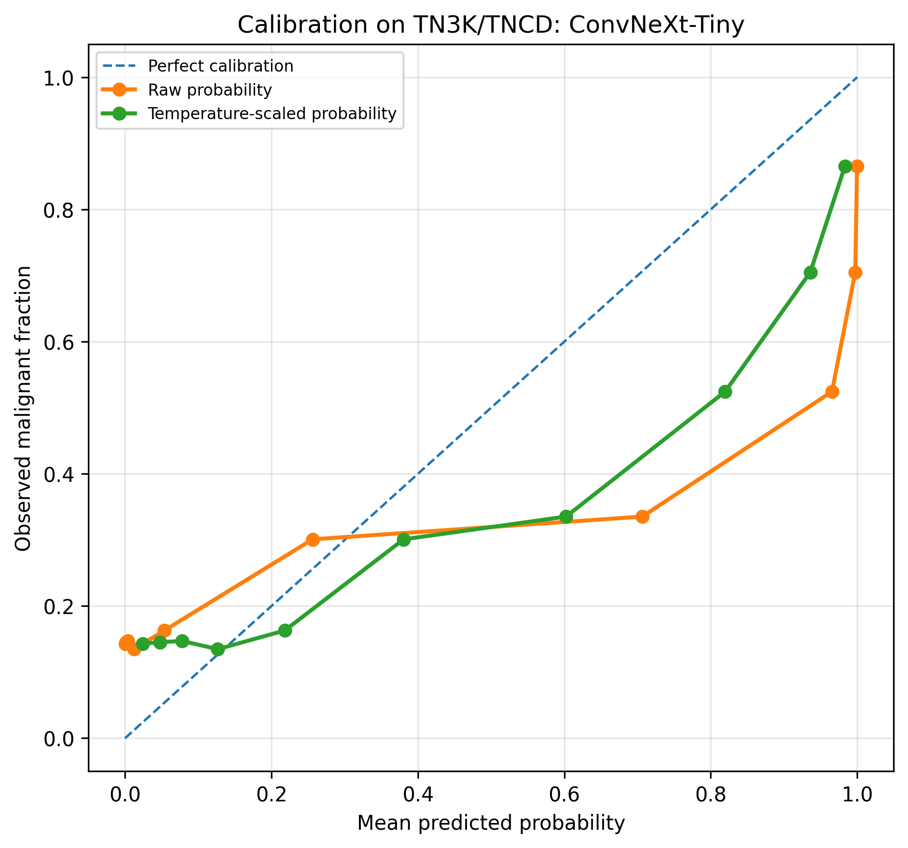
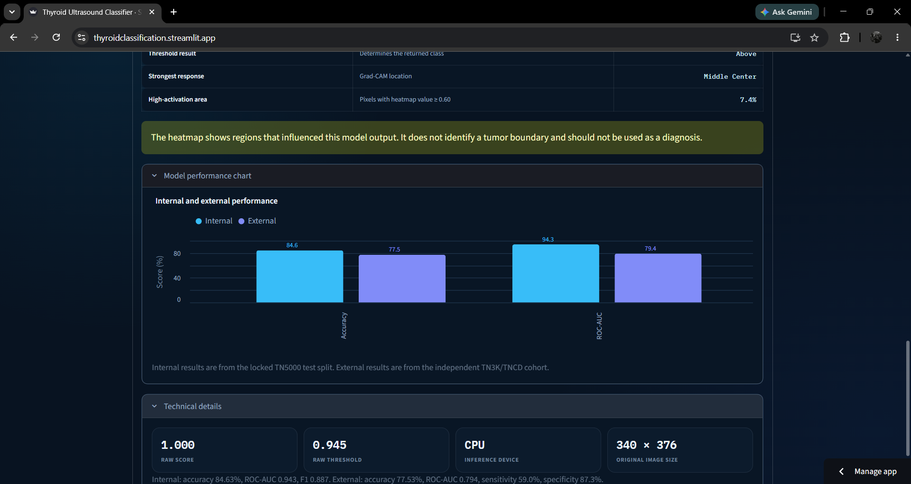

<div align="center">

# Deep Learning for Ultrasound Thyroid Nodule Classification

**Mir Hasnain Hyder¹**, **Mir Allahyar Khan Talpur²**, **Ramesh Kumar Ayyasamy²**,  
**Mubariz Rehman³**, **Syed Saad Ahmed³**, **Hamid Ur Rehman²**

¹ Institute of Mathematics & Computer Science, University of Sindh, Jamshoro, Pakistan  
² Universiti Tunku Abdul Rahman, Kampar, Perak, Malaysia  
³ Faculty of Computing, Riphah International University, Islamabad, Pakistan

**Author emails:**  
Mir Hasnain Hyder — [hassnainmeer942@gmail.com](mailto:hassnainmeer942@gmail.com)  
Mir Allahyar Khan Talpur — [talpurmirallahyar@1utar.my](mailto:talpurmirallahyar@1utar.my)  
Ramesh Kumar Ayyasamy — [rameshkumar@utar.edu.my](mailto:rameshkumar@utar.edu.my)  
Mubariz Rehman — [mubariz.rehman@riphah.edu.pk](mailto:mubariz.rehman@riphah.edu.pk)  
Syed Saad Ahmed — [saad.jaffari15@1utar.my](mailto:saad.jaffari15@1utar.my)  
Hamid Ur Rehman — [hamidrehman@1utar.my](mailto:hamidrehman@1utar.my)

**Submitted to:** [3rd International Conference on Computing and Data Analytics (ICCDA 2026)](https://iccda.utas.edu.om/)  
**Venue:** Salalah, Oman  
**Paper status:** Submitted manuscript

A leakage-safe comparison of six deep-learning models, externally validated on an independent thyroid-ultrasound dataset and deployed as a Streamlit research application.

[**Research**](#part-1--research) · [**Web App**](#part-2--web-application) · [**Live Demo**](https://thyroidclassification.streamlit.app) · [**Manuscript**](./docs/Final_Manuscript.pdf) · [**Notebook**](./notebook.ipynb)

</div>

---

## Project at a glance

This repository has two connected parts:

### [Part 1 — Research](#part-1--research)

A controlled comparison of MobileNetV2, EfficientNet-B0, ResNet-50, DenseNet-121, ConvNeXt-Tiny, and Swin Transformer-Tiny using leakage-safe TN5000 data and independent external validation on TN3K/TNCD.

### [Part 2 — Web Application](#part-2--web-application)

A Streamlit application that deploys the selected ConvNeXt-Tiny checkpoint for research demonstration, including prediction scores, threshold information, Grad-CAM explanation, and internal-versus-external performance context.

---

# Part 1 — Research

## Research question

The study asks a practical question:

> How well do thyroid-ultrasound classifiers generalize when tested on an independent dataset without retraining, threshold adjustment, or recalibration?

The focus was not only internal accuracy. The study also examined:

- duplicate leakage,
- external generalization,
- threshold transfer,
- probability calibration,
- reproducibility across random seeds,
- error patterns and computational efficiency.

## Study workflow

<p align="center">
  
</p>

TN5000 was used for training, validation, threshold selection, calibration, and locked internal testing. TN3K/TNCD was kept completely separate and used only for external validation.

An MD5 audit identified duplicate-image groups in TN5000. After removing duplicates, 4,874 images remained for leakage-safe development and internal evaluation. The external cohort contained 3,493 images.

Six architectures were trained with the same overall protocol across five random seeds.

## Main finding

All six models performed worse on the external dataset than on the internal test split. This confirmed that strong internal results alone were not enough to judge deployment reliability.

<p align="center">
  
</p>

The figure shows the drop from TN5000 internal performance to TN3K/TNCD external performance across all six models.

## External model comparison

<p align="center">
  
</p>

ConvNeXt-Tiny achieved the highest external ROC-AUC at **0.790**, closely followed by DenseNet-121 at **0.787**.

<p align="center">
  
</p>

ConvNeXt-Tiny also produced the strongest external precision-recall performance in the study-level comparison.

## Why ConvNeXt-Tiny was selected

ConvNeXt-Tiny was selected for the web application because it provided the strongest overall external performance:

- highest external ROC-AUC,
- highest external PR-AUC,
- highest external sensitivity,
- highest external F1-score.

DenseNet-121 remained a very close alternative, with slightly higher external accuracy and specificity and the smallest internal-to-external ROC-AUC gap.

The selected web-app checkpoint represents one trained ConvNeXt-Tiny model. Therefore, values shown in the app may differ slightly from manuscript values, which summarize performance across five seeds.

## Confusion matrix

<p align="center">
  
</p>

The representative external evaluation correctly classified 1,868 benign and 774 malignant nodules, while producing 415 false positives and 436 false negatives.

The false-negative count is one reason this system is presented only as a research prototype.

## Calibration

<p align="center">
  
</p>

Temperature scaling improved probability reliability, but calibration remained imperfect after transfer to the external dataset. The displayed probability should therefore not be interpreted as a guaranteed clinical risk estimate.

## Research conclusion

The study shows that reliable thyroid-ultrasound AI evaluation requires more than internal accuracy. External validation, leakage auditing, locked-threshold testing, and calibration analysis all changed how the models were understood.

Future work should include patient-level evaluation, prospective multicenter validation, clinical variables, radiologist comparison, and clinically informed threshold selection.

[Read the full manuscript](./docs/Final_Manuscript.pdf)

---

# Part 2 — Web Application

## Live application

[**Open the deployed Streamlit app**](https://thyroidclassification.streamlit.app)

<p align="center">
  
</p>

The web app turns the selected ConvNeXt-Tiny checkpoint into an inspectable research demonstration.

## What the app does

### Image upload and preprocessing

The app accepts a thyroid-ultrasound image, validates it, converts it to RGB, resizes it to `224 × 224`, and applies the same normalization used during model evaluation.

### Prediction

The model generates a malignancy score. The inference pipeline then reports:

- raw score,
- calibrated probability,
- locked threshold,
- benign or malignant result.

### Grad-CAM explanation

The app displays a Grad-CAM heatmap showing which image regions influenced the model output.

The heatmap is not a tumor boundary or segmentation result.

### Performance context

Internal and external performance are displayed together so that the model is not presented only through its stronger internal results.

### Technical details

The app also shows information such as:

- model architecture,
- selected seed,
- inference device,
- original image size,
- raw threshold,
- internal and external metrics.

## Application flow

```text
Uploaded ultrasound image
        ↓
Streamlit interface
        ↓
Image validation and preprocessing
        ↓
ConvNeXt-Tiny model checkpoint
        ↓
Raw score and calibrated probability
        ↓
Locked threshold
        ↓
Prediction and Grad-CAM explanation
```

## Main application files

```text
ThyroidClassification_webapp_TeamC7255B/
├── app.py
├── backend/app/inference.py
├── backend/app/model_def.py
├── backend/app/main.py
├── model/model_config.json
├── model/convnext_tiny_seed123_best.pt
└── tests/test_config.py
```

- `app.py` controls the Streamlit interface.
- `inference.py` handles preprocessing, checkpoint loading, calibration, thresholding, and prediction.
- `model_def.py` creates the ConvNeXt-Tiny architecture.
- `main.py` provides optional FastAPI endpoints.
- `model_config.json` stores the deployed model settings and metrics.
- The `.pt` file contains the trained weights and is stored through Git LFS.

## Run locally

```powershell
cd ThyroidClassification_webapp_TeamC7255B
.\setup_windows.ps1
.\run_windows.ps1
```

The Streamlit deployment uses:

```text
Python: 3.12
Main file: ThyroidClassification_webapp_TeamC7255B/app.py
```

---

## Responsible use

This application is for **research and educational use only**.

It is not intended to:

- diagnose thyroid cancer,
- replace a radiologist or clinician,
- determine treatment or biopsy decisions,
- provide a validated patient-level risk estimate,
- identify an exact tumor boundary.

---

## Repository links

- [Live application](https://thyroidclassification.streamlit.app)
- [Full manuscript](./docs/Final_Manuscript.pdf)
- [Research notebook](./notebook.ipynb)
- [Final research outputs](./thyroid_external_validation_outputs/)
- [Web application source](./ThyroidClassification_webapp_TeamC7255B/)
- [Model card](./ThyroidClassification_webapp_TeamC7255B/MODEL_CARD.md)

---

## Citation

```bibtex
@inproceedings{thyroid_external_validation_2026,
  author    = {Mir Hasnain Hyder and Mir Allahyar Khan Talpur and Ramesh Kumar Ayyasamy and Mubariz Rehman and Syed Saad Ahmed and Hamid Ur Rehman},
  title     = {Deep Learning for Ultrasound Thyroid Nodule Classification: A Comparative Study},
  booktitle = {3rd International Conference on Computing and Data Analytics (ICCDA 2026)},
  year      = {2026},
  address   = {Salalah, Oman},
  note      = {Submitted manuscript}
}
```

## License

`[ADD LICENSE OR USAGE TERMS]`
