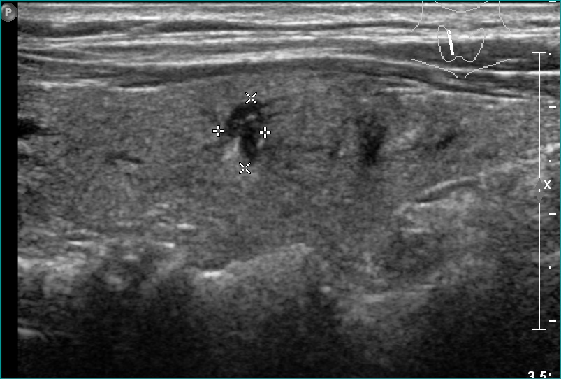
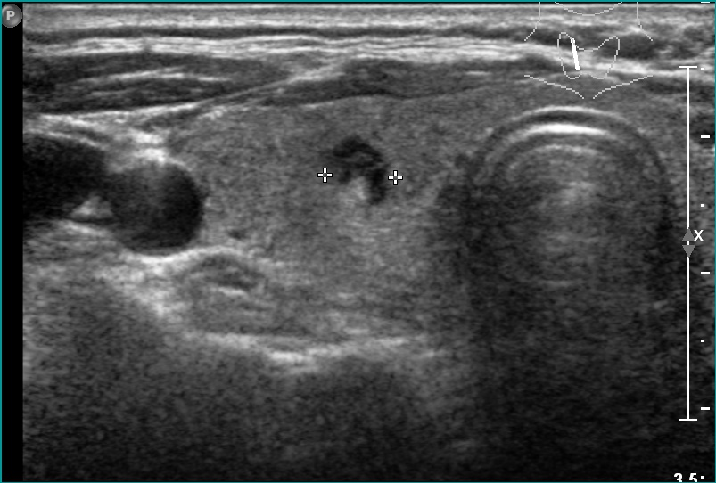
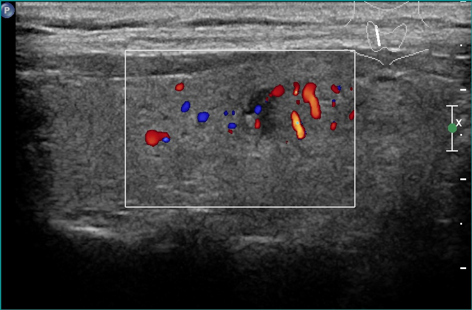
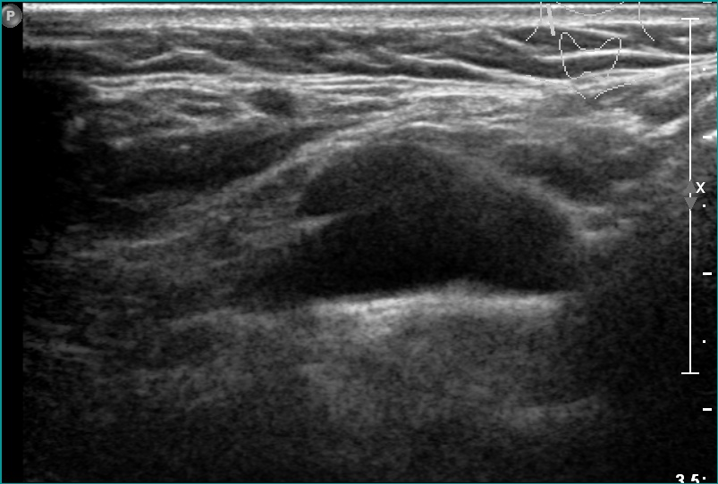
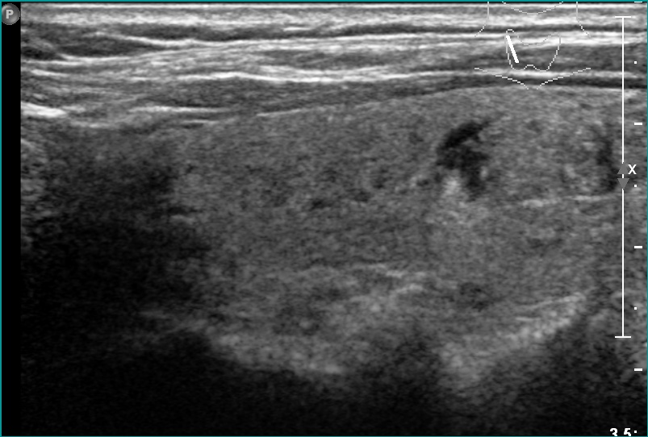

# TN3K/TNCD external-dataset samples

This folder contains five representative ultrasound images from the independent TN3K/TNCD external-validation cohort.

The supplied images belong to patient `600`, whose class ID is `0`, corresponding to **benign** in the project label mapping.

Only the images and a compact manifest are included here. The complete image-index and patient-label CSV files were intentionally excluded because they are not required for the repository sample gallery.

## Files

- `images/` — five ultrasound examples
- `manifest.csv` — filename, patient ID, and class label

## Preview

  
  
  

  
  

These images are included only as small visual examples. The full external dataset is not redistributed in this repository. Consult the original TN3K/TNCD sources and their usage terms before reuse.
