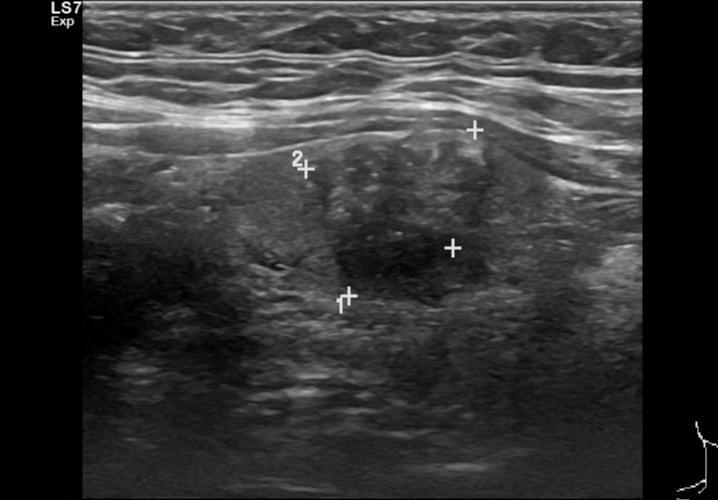
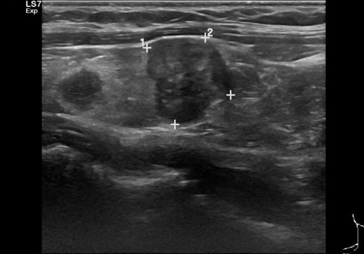
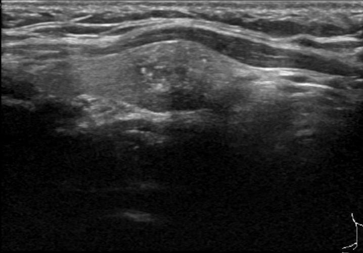
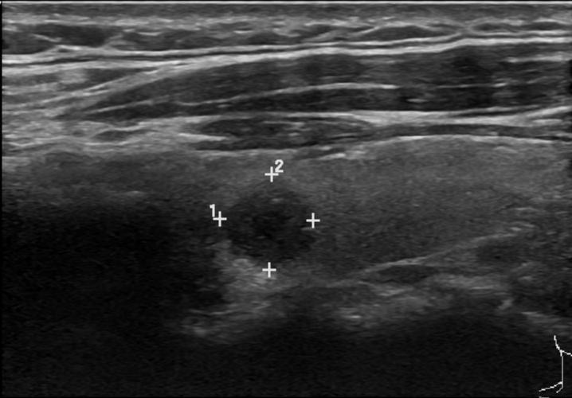
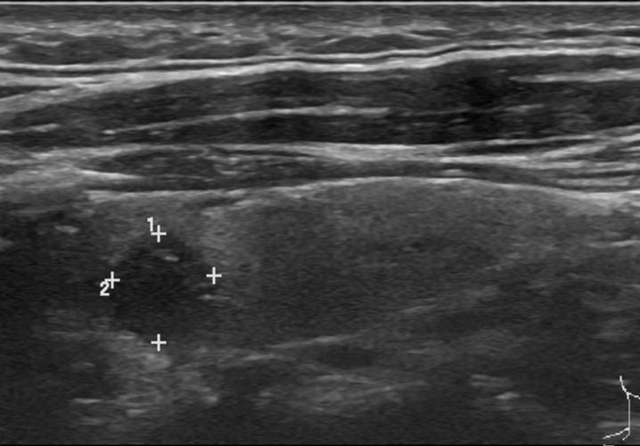

# TN5000 internal-dataset samples

This folder contains five representative ultrasound images from the TN5000 dataset used for internal model development and evaluation.

All five supplied examples have class ID `1`, corresponding to **malignant** in the project label mapping.

Only the images and a compact manifest are included here. The original Pascal VOC XML annotations and complete train/validation/test list files were intentionally excluded because they are not required for the repository sample gallery.

## Files

- `images/` — five ultrasound examples
- `manifest.csv` — filename, class label, original split, and bounding-box coordinates

## Preview

  
  
  

  
  

These images are included only as small visual examples. The full dataset is not redistributed in this repository. Consult the original TN5000 source and its usage terms before reuse.
